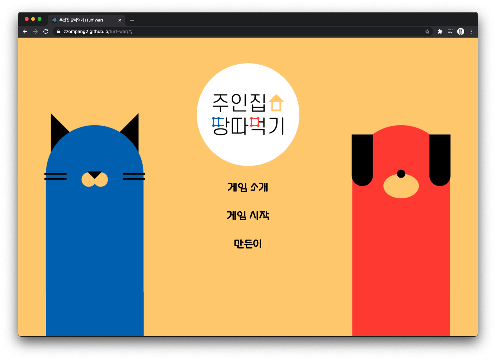
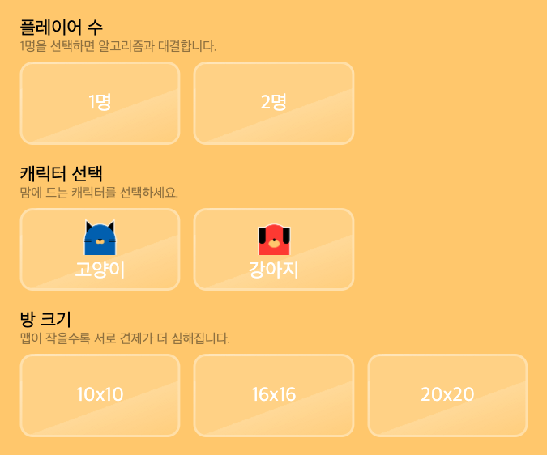
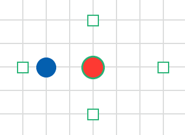
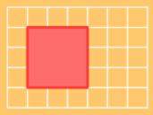
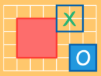

# 주인집 땅따먹기 (turf war)

주사위를 굴려 땅을 최대한 많이 먹는 게임입니다.
(2021.01.08 2:14 개발 시작)

🔗 **[게임 플레이하기](https://goodsoo.github.io/turf-war/)**

## 메인 화면

## 게임 설정

플레이어 수(1명 = 알고리즘과 대결 / 2명), 캐릭터(고양이·강아지), 방 크기(10×10 ~ 20×20)를 선택합니다.

## 게임 규칙

<table>
  <tr>
    <td></td>
    <td></td>
    <td></td>
  </tr>
  <tr>
    <td align="center">인접한 칸으로 이동</td>
    <td align="center">영역을 둘러싸 땅 차지</td>
    <td align="center">놓을 수 있는 칸(O) / 없는 칸(X)</td>
  </tr>
</table>
